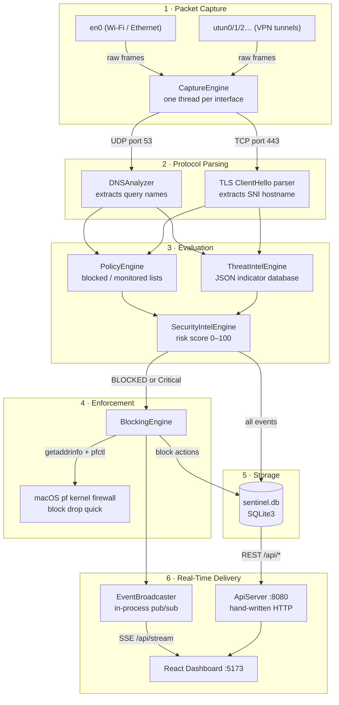

# 🛡️ Sentinel DPI

---

**Sentinel DPI is a local, system-wide network security engine that runs entirely on your machine.** It sits between the network interfaces and the outside world — reading raw packets off the wire before they leave the machine, identifying what domains and services the system is trying to reach, and — if those destinations are malicious or blocked by policy — cutting the connection dead at the kernel level using macOS's built-in `pf` firewall.

This is **not** a VPN. It is **not** a DNS sinkhole. It operates at a lower level than both: it reads raw packets directly from the network adapter using `libpcap`, parses DNS queries and TLS handshakes out of them, and enforces decisions using kernel firewall rules.

---

## What Problem Does It Solve?

| Problem | How Sentinel DPI Addresses It |
|---|---|
| VPNs route traffic through a tunnel, bypassing traditional host-based inspection | Captures `utun*` interfaces (macOS VPN tunnel adapters) before encryption happens |
| DNS-based blockers can be bypassed by hardcoded IPs | Combines DNS inspection with TLS SNI inspection so hostnames are extracted from both protocols |
| Threat intelligence databases go stale | Auto-fetches updated feeds (OpenPhish, URLHaus) on a configurable schedule and reloads them live without restarting |
| No visibility into what your own machine is actually doing on the network | Provides a real-time dashboard showing every packet, its domain, IPs, and protocol as they happen |

---

## How It Works — The Full Pipeline

Here is the journey a single packet takes from the wire to the dashboard:

### 1. Packet Capture (`CaptureEngine`)

At startup, every active network interface is enumerated — both physical adapters like `en0` (Wi-Fi) and virtual VPN tunnel interfaces like `utun0`, `utun1`, `utun2`. A raw `libpcap` capture handle is opened on each one and a dedicated OS thread is spun up per interface, all capturing concurrently.

Each thread runs `pcap_loop()`, which fires a callback for every packet that arrives on that interface. **This happens before the packet is processed by any higher-level OS network stack.** All threads share a mutex-protected write path into the database and event broadcaster.

> Why capture `utun*` interfaces? When a VPN is active, apps connect through a virtual tunnel adapter. The VPN daemon then encrypts and forwards the traffic. The TLS handshake and DNS lookup happen on the `utun` side — before encryption — so capturing there gives full visibility even when a VPN is running.

### 2. Protocol Parsing — DNS & TLS SNI

Raw Ethernet frames are parsed to extract IP-layer source and destination addresses, then the engine looks for two types of payloads:

- **DNS queries (UDP port 53)**: The `DNSAnalyzer` parses the DNS wire format to extract the queried hostnames. When the machine asks "what is the IP of example.com?", that query appears as a DNS packet and the domain name is read directly from it.

- **TLS Client Hello (TCP port 443)**: When a browser or app initiates an HTTPS connection, it sends a `ClientHello` message containing a **Server Name Indication (SNI)** extension — a plaintext field that tells the server which hostname is being requested. The TLS handshake is parsed and the SNI hostname is extracted. This works even for HTTPS because SNI is transmitted before encryption is negotiated.

Once a hostname is extracted, it is passed to the evaluation pipeline.

### 3. Policy Evaluation (`PolicyEngine`)

The `PolicyEngine` loads two plain-text files from the project root:
- `blocked_domains.txt` — domains to block
- `monitored_domains.txt` — domains to watch but not block

**Hot reload**: The file modification timestamp is checked before every evaluation. If `blocked_domains.txt` is edited while the daemon is running, the new rules are picked up automatically on the next packet — no restart needed.

**Subdomain matching**: Both exact matches and wildcard rules are supported. Adding `example.com` to `blocked_domains.txt` will match `example.com`, `www.example.com`, `api.example.com`, `cdn.example.com`, etc. Suffix lookup tables are built for O(1) evaluation per packet.

**Two match types**:
- `BLOCKED` — domain is in the block list
- `MONITORED` — domain is in the monitor list

### 4. Threat Intelligence Matching (`ThreatIntelEngine`)

In parallel with policy evaluation, the extracted hostname is checked against a local indicator database loaded from `threats.json`. This file is a merged collection of threat indicators, each with a domain, category (e.g. `Phishing`, `Malware`, `Command & Control`), severity (`Low`, `Medium`, `High`, `Critical`), and description.

Two in-memory hash maps are maintained:
- **Exact rules** — direct domain matches
- **Wildcard rules** — suffix-based matches (e.g. all subdomains of a known malicious registrar)

Like the policy engine, this hot-reloads when `threats.json` changes on disk — which happens automatically every 12 hours when the background feed updater runs.

### 5. Blocking (`BlockingEngine` + `MacOSPfBackend`)

When a domain is flagged as `BLOCKED` (either by policy or by threat intelligence matching a known-malicious indicator), the `BlockingEngine` takes over.

It calls `MacOSPfBackend::blockDomain()`, which:
1. Performs a live DNS resolution of the domain using `getaddrinfo()` to get its current IP addresses
2. Writes a `pf` anchor config file to `/tmp/sentineldpi_pf_anchor.conf` containing `block drop quick to { <ip1>, <ip2>, ... }` rules for each resolved IP
3. Loads that file into the macOS kernel firewall:
   ```bash
   pfctl -a sentineldpi/blocklist -f /tmp/sentineldpi_pf_anchor.conf
   ```

The `block drop quick` rule instructs the kernel to silently discard any outbound packets destined for those IPs — no TCP RST, no ICMP unreachable, just a silent drop. The connection attempt times out from the app's perspective.

This happens at the **kernel routing layer** — below any application, browser, or VPN daemon. Nothing can bypass it while the rule is active.

### 6. Persistence (`Database` — SQLite3)

Every event is written to `sentinel.db`, a local SQLite3 database. The schema stores:
- Traffic events (domain, source IP, destination IP, protocol, timestamp)
- Policy match events
- Threat match events
- Security analysis records
- Firewall block/unblock actions
- Threat feed update logs

This gives the frontend historical data to display — charts, leaderboards, and logs all query this database.

### 7. Real-Time Event Delivery (`EventBroadcaster` + `ApiServer`)

A simple in-process pub/sub hub called `EventBroadcaster` handles real-time delivery. Every time a significant event occurs (a packet is captured, a domain is blocked, a threat is matched), the relevant subsystem emits a JSON payload to the broadcaster.

The `ApiServer` runs a hand-written HTTP/1.1 server on port 8080 — no external web framework, just pure POSIX sockets. It serves two categories of endpoints:
- **REST endpoints** (`/api/events`, `/api/threats`, `/api/firewall/rules`, etc.) — query the SQLite database and return JSON
- **SSE stream** (`/api/stream`) — keeps a persistent HTTP connection open to the React frontend and pushes JSON events in real-time as they arrive

### 8. Dashboard (React Frontend)

The React app connects to the daemon on startup, polls the REST endpoints for historical data, and subscribes to `/api/stream` for live updates. As packets arrive and the daemon broadcasts events, the dashboard updates instantly — the live traffic feed, blocked events alert, threat intelligence panel, and analytics charts all reflect what is happening right now.

---

## 🗂️ Project Structure

```
sentinel-dpi/
├── backend/
│   └── src/
│       ├── main.cpp                # Entry point — wires all subsystems together
│       ├── CaptureEngine.cpp/h     # libpcap multi-interface packet capture & parsing
│       ├── DNSAnalyzer.cpp/h       # DNS wire-format query parser
│       ├── PolicyEngine.cpp/h      # blocked/monitored domain matching with hot-reload
│       ├── ThreatIntel.cpp/h       # In-memory threat indicator lookup engine
│       ├── ThreatFeedUpdater.cpp/h # Background threat feed download & merge
│       ├── SecurityIntel.cpp/h     # Deterministic risk scoring algorithm
│       ├── BlockingEngine.cpp/h    # Coordinates firewall block/unblock decisions
│       ├── FirewallBackend.cpp/h   # macOS pf (pfctl) integration
│       ├── Database.cpp/h          # SQLite3 schema and all queries
│       ├── EventBroadcaster.cpp/h  # In-process pub/sub for SSE delivery
│       ├── ApiServer.cpp/h         # Hand-written HTTP server + SSE stream on :8080
│       └── AppConfig.cpp/h         # config.json loader
├── frontend/
│   └── src/
│       ├── App.jsx                 # Root component, page routing
│       ├── pages/                  # One component per dashboard section
│       ├── components/             # Layout, shared UI components
│       ├── hooks/useDashboardData  # REST polling + SSE subscription hook
│       ├── lib/                    # Metrics, formatting, domain parsing helpers
│       └── config.js               # API base URL, app version
├── CMakeLists.txt                  # Root CMake — C++20, adds backend subdirectory
├── config.json                     # Runtime config for all backend modules
├── blocked_domains.txt             # Domains to block via pf (hot-reloaded)
├── monitored_domains.txt           # Domains to alert on without blocking (hot-reloaded)
├── threat_feeds.json               # Feed source list for the background updater
├── threats.json                    # Merged indicator database (auto-generated)
└── sentinel.db                     # SQLite database (auto-created on first run)
```

---

## 🛠️ Tech Stack

**Backend (C++20)**

| Component | Technology | Why |
|---|---|---|
| Packet capture | `libpcap` | Direct BPF access — lowest level raw packet capture on macOS |
| Packet parsing | `PcapPlusPlus` *(optional)* | High-level DNS/TLS/IP layer abstractions over libpcap |
| Database | `SQLite3` | Zero-config embedded SQL — no database server needed |
| HTTP server | Raw POSIX sockets | No external dependency — hand-written HTTP/1.1 with SSE support |
| Firewall | `pfctl` (macOS pf) | Native kernel firewall, no kernel extension or driver required |
| Threading | `std::thread` + `std::mutex` | One capture thread per interface, safely synchronized |

**Frontend (React)**

| Component | Technology |
|---|---|
| Framework | React 18 + Vite 5 |
| Styling | Tailwind CSS 3 |
| Charts | Recharts |
| Build | Vite (ESM, HMR) |

---

## 🚀 Getting Started

### Prerequisites

```bash
# Install build tools and dependencies via Homebrew
brew install cmake sqlite

# Optional: install PcapPlusPlus for enhanced packet parsing
brew install pcapplusplus
```

Also install Node.js (v18+) for the frontend. Check with `node --version`.

---

### Step 1 — Build the C++ Backend

Run from the **project root**:

```bash
mkdir -p build
cd build
cmake ..
cmake --build . --config Release
```

The binary is placed at `build/backend/sentineldpi` relative to the project root.

> **Apple Silicon (M1/M2/M3)?** If CMake cannot auto-locate PcapPlusPlus:
> ```bash
> # Inside the build/ directory:
> cmake -DUSE_PCAPPP=ON \
>   -DPCAPP_INCLUDE_DIR="/opt/homebrew/include/pcapplusplus" \
>   -DPCAPP_LIBS="/opt/homebrew/lib/libPcapPlusPlus.a" ..
> cmake --build . --config Release
> ```

---

### Step 2 — Run the Backend Daemon

> ⚠️ **Critical — Working Directory**: Always run the daemon from the **project root** (the directory containing `config.json`). It reads all config and data files relative to `./`. Running from inside `build/` will silently fail to find `blocked_domains.txt`, `config.json`, and `sentinel.db`.

> ⚠️ **Why `sudo`**: Raw packet capture requires root access to `/dev/bpf*` (Berkeley Packet Filter) devices. The macOS kernel blocks access without it. You will see `Permission denied` if you run without `sudo`.

```bash
# From the project root — NOT from inside build/
sudo ./build/backend/sentineldpi en0
```

Replace `en0` with your active interface if needed. Run `ifconfig` to list all interfaces.

**Healthy startup looks like this:**
```
Sentinel DPI - daemon starting
Firewall backend preference: pf
Capture device preference: en0
CaptureEngine: thread starting for device en0...
CaptureEngine: thread starting for device utun0...
CaptureEngine: thread starting for device utun1...
ApiServer: listening on port 8080
ThreatIntel: loaded 5 indicators
Press Enter to stop...
```

To stop the daemon, press **Enter**. This triggers a graceful shutdown: capture threads are joined, all `sentineldpi` pf anchor rules are flushed from the kernel, and the database is closed.

---

### Step 3 — Run the Frontend Dashboard

Open a **second terminal** from the project root:

```bash
cd frontend
npm install        # first time only
npm run dev
```

Open `http://localhost:5173` in your browser.

The frontend connects to the daemon at `http://localhost:8080/api`. If the daemon is not running, it shows a "Unable to load Sentinel DPI" error with a retry button.

---

## ⚙️ Configuration Files

All configuration files live in the **project root** and are read by the daemon at startup. I designed the policy files and threat database to be **hot-reloaded** — edits take effect on the next packet without restarting the daemon.

### `config.json`

```json
{
  "firewall_backend": "pf",
  "threat_intelligence_enabled": true,
  "automatic_threat_updates_enabled": true,
  "security_analysis_enabled": true,
  "threat_update_interval_seconds": 43200,
  "threat_feed_registry": "threat_feeds.json",
  "threat_feed_output": "threats.json"
}
```

| Key | Description |
|---|---|
| `firewall_backend` | `"pf"` is the only supported value on macOS |
| `threat_intelligence_enabled` | Enables threat matching; if false, `ThreatIntelEngine` is not passed to the capture pipeline |
| `automatic_threat_updates_enabled` | Starts the background `ThreatFeedUpdater` thread |
| `security_analysis_enabled` | Enables risk scoring for every captured event |
| `threat_update_interval_seconds` | Feed refresh interval (default `43200` = 12 hours) |
| `threat_feed_registry` | Path to the feed source list |
| `threat_feed_output` | Path where the merged indicator database is written |

---

### `blocked_domains.txt`

One domain per line. Lines starting with `#` are comments. Case-insensitive. Wildcard prefix (`*.`) matches all subdomains.

```
# Exact match — blocks example.com and all its subdomains
example.com

# Explicit subdomain block
www.social-media.com

# Wildcard — blocks anything under a known malicious domain
*.malicious-cdn.com
```

Hot-reloaded: edit and save while the daemon is running — new rules apply on the next packet evaluation.

---

### `monitored_domains.txt`

Same format as `blocked_domains.txt`. Traffic to these domains is **logged and alerted** in the dashboard but is not dropped by the firewall.

---

### `threat_feeds.json`

Defines where the background updater fetches threat indicators from:

```json
{
  "update_interval_hours": 12,
  "feeds": [
    {
      "name": "Local Seed Feed",
      "enabled": true,
      "type": "json",
      "path": "threats.seed.json"
    },
    {
      "name": "OpenPhish",
      "enabled": true,
      "type": "domain-list",
      "url": "https://openphish.com/feed.txt"
    },
    {
      "name": "URLHaus",
      "enabled": true,
      "type": "domain-list",
      "url": "https://urlhaus.abuse.ch/downloads/hostfile/"
    }
  ]
}
```

The updater merges all feeds into `threats.json`. The `ThreatIntelEngine` detects when `threats.json` changes on disk and reloads automatically.

---

## 🛡️ How the macOS PF Firewall Integration Works

macOS ships with a stateful packet filter (`pf`) inherited from BSD. By default it is mostly passive. Sentinel DPI activates it at runtime and injects rules into a named anchor (`sentineldpi`) — `/etc/pf.conf` is never permanently modified.

**On startup:**
```bash
# Enable pf if it was not already running
pfctl -e

# Append the anchor declaration to the existing ruleset and load it
(cat /etc/pf.conf; echo 'anchor "sentineldpi/*"') | pfctl -f -
```

**When blocking a domain:**
1. The domain is resolved to all its current IPv4/IPv6 addresses using `getaddrinfo()`
2. A rule file is written to `/tmp/sentineldpi_pf_anchor.conf`:
   ```
   # blocked-site.com
   block drop quick to { 93.184.216.34, 2606:2800:220:1:248:1893:25c8:1946 }
   ```
3. The file is loaded into the kernel:
   ```bash
   pfctl -a sentineldpi/blocklist -f /tmp/sentineldpi_pf_anchor.conf
   ```

**On clean shutdown:**
All rules in the `sentineldpi` anchor are flushed. The system's `/etc/pf.conf` is **never modified** — all changes are runtime-only and disappear when the daemon exits.

---

## 🔄 Full Architecture Diagram



---

## 📋 Dashboard Sections

| Section | What You See |
|---|---|
| **Overview** | System health status, total DNS/TLS packet counts since startup, a 60-minute traffic volume chart, and the top most-contacted domains |
| **Live Traffic** | A live-updating stream of every captured packet — hostname, source IP, destination IP, protocol, and timestamp |
| **Statistics** | DNS vs. TLS packet distribution pie chart, peak usage hour heatmap, and a top-10 domain leaderboard by packet count |
| **Policies** | A log of every event where a domain matched your `blocked_domains.txt` or `monitored_domains.txt` rules |
| **Raw Feed** | Per-event security assessments — risk score, severity, category, explanation string, and recommendation (Monitor / Investigate / Block) |
| **Threat Intelligence** | Events where a captured domain matched a threat indicator — shows category, severity, and description from the feed |
| **Threat Feeds** | Status of each configured feed source, last refresh timestamp, and total loaded indicator count |
| **Blocked Events** | Log of all firewall block events. A live alert popup flashes when an actively-blocked site is contacted (auto-dismisses after 12 seconds of idle) |
| **Firewall** | Manual control panel — view all active pf rules, add a domain or IP to the blocklist, or remove existing rules |
| **Settings** | App version, daemon connection state, active capture interface, and environment info |

---

## 🔌 API Endpoints

The daemon exposes a JSON API on **port 8080**:

| Endpoint | Method | Description |
|---|---|---|
| `/api/events` | GET | Paginated captured traffic events |
| `/api/domains` | GET | Per-domain statistics aggregated from events |
| `/api/policies` | GET | Policy match event log |
| `/api/threats` | GET | Threat indicator match log |
| `/api/security` | GET | Security analysis records with risk scores |
| `/api/feeds` | GET | Threat feed metadata and status |
| `/api/blocked` | GET | Active blocked event log |
| `/api/firewall/rules` | GET | Current active pf rules |
| `/api/firewall/block` | POST | Add a domain or IP to the blocklist |
| `/api/firewall/unblock` | POST | Remove a domain or IP from the blocklist |
| `/api/stream` | GET (SSE) | Persistent real-time event stream for the dashboard |

---

## 📝 Notes

- **Hot-reload without restart**: Both `PolicyEngine` and `ThreatIntelEngine` check file modification timestamps before each evaluation and reload automatically if anything changed. Edits to `blocked_domains.txt` take effect on the very next packet — no restart needed.
- **No persistent system changes**: `/etc/pf.conf` is never modified. All pf rules live in the `sentineldpi` anchor and are flushed when the daemon exits.
- **Thread model**: One `std::thread` is spawned per active network interface in `CaptureEngine`. All threads share the database and broadcaster through mutex-protected paths.
- **Database location**: `sentinel.db` is created in the current working directory at startup — always run the daemon from the project root.
- **Graceful stop**: Press **Enter** in the daemon terminal. Avoid `Ctrl+C` for a clean shutdown — `SIGINT` skips the cleanup path and leaves pf rules loaded in the kernel.
